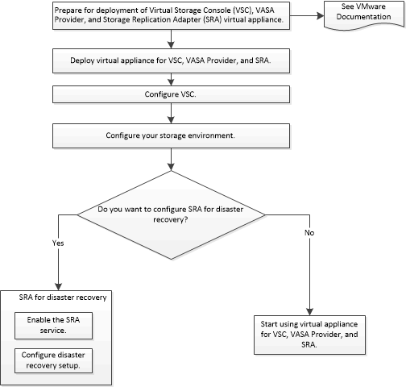

= 适用于VSC、VASA Provider和SRA虚拟设备新用户的部署工作流
:allow-uri-read: 
:icons: font
:imagesdir: ../media/

[role="lead"]
如果您是VMware的新用户且从未使用过NetApp VSC产品、则在部署和配置VSC、VASA Provider和SRA虚拟设备之前、您需要配置vCenter Server并设置ESXi主机。

