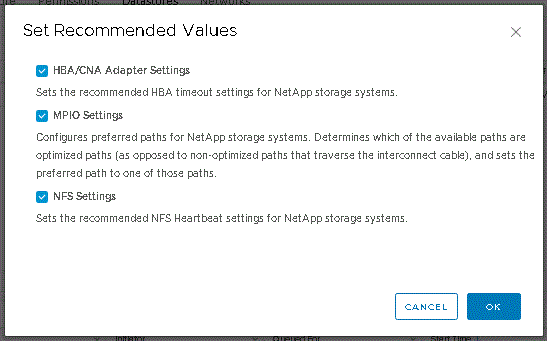

= 配置 ESXi 服务器多路径和超时设置
:allow-uri-read: 
:experimental: 
:icons: font
:imagesdir: ../media/

[role="lead"]
适用于VMware vSphere的Virtual Storage Console可检查并设置最适合存储系统的ESXi主机多路径设置和HBA超时设置。

.关于此任务
此过程可能需要很长时间，具体取决于您的配置和系统负载。任务进度显示在*近期任务*面板中。任务完成后，主机状态警报图标将替换为正常图标或等待重新启动图标。

.步骤
. 在VMware vSphere Web Client *主页*页面中、单击菜单：vCenter[主机]。
. 右键单击某个主机、然后选择菜单：操作[NetApp VSC >设置建议值]。
. 在* NetApp建议设置*对话框中、选择最适合您的系统的值。
+
默认情况下会设置标准建议值。

+

. 单击 * 确定 * 。

